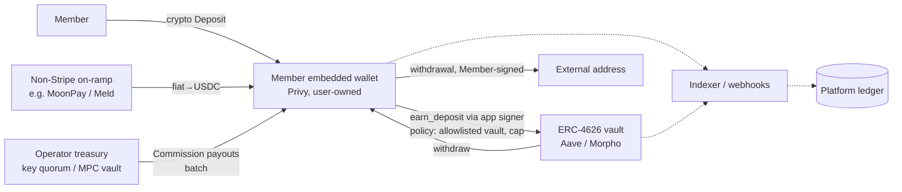
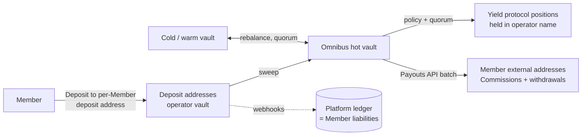

# 02 — Wallets, account abstraction and custody

- **Project:** Helm (Cyclone for AlphaWave)
- **Workstream:** Wallets, account abstraction, custody
- **Research date:** 2026-10-06
- **Currency:** USD unless stated otherwise
- **Method:** Desk research of vendor documentation, pricing pages, legal terms, trust centres and GitHub. We did not contact any vendor or create any account.

**Evidence labels**

- **Verified:** confirmed on a primary source, such as official docs, a pricing page, legal terms, an audit report or an investor-relations release.
- **Vendor claim:** a statement the vendor makes about itself (marketing, blog, docs describing its own security) that no independent source confirms. Example: SOC 2 status when the report has not been seen.
- **Not verified:** no primary evidence found, or the source could not be accessed.
- **Assumption:** Cyclone's working assumption, stated for transparency.

Glossary terms (Member, Deposit, Commission, Yield Product, Staking, Sponsor Tree) are used as defined in `GLOSSARY.md`.

---

## 1. Summary and recommendation

### Key findings

1. **Privy is technically a strong fit, but its fiat and custodial features depend on a Stripe company that prohibits MLM.**
   - Stripe acquired Privy in June 2025. Privy now describes itself as "a Stripe company" and runs as an independent product. **Verified** ([Privy about](https://privy.io/about-us), [CoinDesk](https://www.coindesk.com/business/2025/06/11/stripe-to-acquire-crypto-wallet-startup-privy-in-bid-to-expand-web3-capabilities)).
   - Privy's own [Acceptable Use Policy](https://www.privy.io/acceptable-use-policy) (updated 2025-12-16) does **not** name multi-level marketing. **Verified**. It does prohibit two things that matter here:
     - "deceptive, fraudulent, or abusive acts or practices";
     - acting "as a custodian, payment services institution, money transmitter, or similar capacity without appropriate licensure".
   - Privy's fiat deposits, fiat payouts and custodial wallets all run on **Bridge (a Stripe company)**. **Verified** ([fiat deposits](https://docs.privy.io/wallets/funding/fiat-deposits/overview), [custodial wallets](https://docs.privy.io/wallets/custodial-wallets/overview)).
   - Bridge's [Developer Agreement](https://www.bridge.xyz/legal/developer-agreement) lists **"multi-level marketing"** on its Prohibited Activities List. The same list also includes "investment or credit services" and money services or money transmission "provided by Users to third parties". **Verified**.
   - Privy's default card on-ramp is **Stripe Crypto Onramp**. **Verified** ([deposit configuration](https://docs.privy.io/financial-flows/deposits/configuration)).
   - **Implication:** AlphaWave should plan **without** Privy's Bridge- and Stripe-backed features: fiat deposit accounts, fiat payouts, custodial wallets and the Stripe onramp. The core non-custodial wallet, policy engine, signer and Earn features do not appear to need a Bridge or Stripe account (**Assumption**, to be confirmed with Privy).

2. **No wallet model is non-custodial just because it uses embedded wallets or smart accounts.**
   - Every vendor reviewed lets the platform add server-side signers: Privy signers, Dynamic Delegated Access, Turnkey delegated API keys, Coinbase CDP delegation, Alchemy session keys, Safe modules and thirdweb session keys.
   - Once the platform holds a signer that can move or redeploy Member funds without approving each transaction, the model becomes **hybrid**: signing authority is shared and bounded by policy.
   - If the platform holds all signing authority (server wallets, MPC vaults, omnibus treasury), the model is **custodial** from the Member's point of view. This holds even when the vendor markets the product as "self-custody", because the vendor means self-custody **for the business**.

3. **Commission payouts need a platform treasury wallet in every scenario.** That treasury is always custodial, because the operator controls it. The design choice is only about where **Member Deposits** sit.

4. **Several vendors explicitly restrict MLM.**
   - Bridge prohibits MLM. **Verified**.
   - BitGo's USD1 stablecoin terms prohibit "any sort of Ponzi scheme, pyramid scheme, or multi-level marketing program". **Verified** ([USD1 terms](https://www.bitgo.com/usd1-terms/)).
   - Coinbase's Prohibited Use Policy appears, in search-indexed text, to prohibit "Multi-level marketing: pyramid schemes, network marketing, and referral marketing programs". **Not verified**: the page returned HTTP 403 ([link](https://www.coinbase.com/legal/prohibited_use)).
   - Every vendor must be asked directly whether it will onboard an MLM-distributed Yield Product. This is a gating item ahead of technical fit.

### Recommendation (subject to vendor confirmation and legal advice)

| Role | Recommendation | Conditions |
|---|---|---|
| **Base case (Member wallets)** | **Privy embedded wallets** (TEE + 2-of-2 Shamir), user-owned, with a narrowly scoped app **signer** limited by a Privy policy to `earn_deposit` / `earn_withdraw` on allowlisted vaults with amount caps. Use Privy Earn (Aave / Morpho ERC-4626 vaults) for lending-based yield. No Bridge or Stripe features. | (a) Privy confirms in writing that it accepts the business model and that core wallet features need no Stripe or Bridge account. (b) Enterprise plan pricing obtained: the policy engine, key quorums and production transaction webhooks are listed as Enterprise. (c) Legal counsel confirms how a hybrid model (app signer present) is classified. (d) A non-Stripe on-ramp is selected (MoonPay or Meld are configurable in Privy; their own MLM policies need checking). |
| **Base case (treasury / Commission payouts)** | A separate **operator treasury** with quorum approval. Either a Privy server wallet owned by a **key quorum** (for example 2-of-3 authorization keys held by finance, ops and a security officer), or a Fireblocks / Cobo vault if institutional controls are wanted from day one. | Treasury signing keys never sit on the same server as the app signer used for Member wallets. |
| **Fallback (if Privy or Stripe declines, or counsel prefers it)** | **Turnkey** for embedded wallets. It is independent, has the most granular policy language (contract, amount, chain, 7702 and Hyperliquid ApproveAgent conditions) and publishes per-signature pricing. Pair it with **Fireblocks or Cobo** for treasury and payouts. | Dynamic (now owned by Fireblocks) is the alternative if a single-vendor Fireblocks relationship is preferred. |
| **Custodial fallback (if the business chooses an omnibus model)** | **Fireblocks** (self-custody MPC for the operator, policy engine, Payouts API, WalletConnect, staking add-on, HyperEVM) or **Cobo** (lower entry price). Use **BitGo** if a qualified custodian is needed. | The operator then holds Member assets. That likely triggers custody or money-transmission questions for legal counsel. Policy engine and approval quorums are mandatory. |

**Do not use for this project** without explicit vendor clearance:

- Privy custodial wallets, fiat deposits and payouts (all Bridge);
- Coinbase CDP (the MLM prohibition is likely, pending manual confirmation);
- BitGo-issued USD1 for Commissions.

**Can be decided now:**

- Treasury wallet separated from Member wallets.
- Policy-engine-enforced app signers only.
- No Member funds exposed to the QUANT trading engine through delegated signers in the first release.

**Needs vendor answers:** MLM acceptance, Enterprise pricing, SOC 2 reports.

**Needs legal confirmation:** whether a platform-held scoped signer makes the platform a custodian or money transmitter in the target jurisdictions.

---

## 2. Privy (base case)

### 2.1 Corporate status and Stripe relationship

| Claim | Label | Source |
|---|---|---|
| Stripe agreed to acquire Privy in June 2025 (terms undisclosed). Privy continues as an independent product. | Verified (press and Privy statement) | [CoinDesk](https://www.coindesk.com/business/2025/06/11/stripe-to-acquire-crypto-wallet-startup-privy-in-bid-to-expand-web3-capabilities), [Decrypt](https://decrypt.co/324674/payments-giant-stripe-acquire-crypto-firm-privy) |
| Privy describes itself as "a Stripe company". | Verified | [privy.io/about-us](https://privy.io/about-us) |
| The contracting entity is **Horkos, Inc. d/b/a Privy**. The Developer ToS was last updated 2025-12-16 and does not name Stripe or Bridge. | Verified | [Developer ToS](https://www.privy.io/developer-terms-of-service) |
| Fiat deposits use Bridge virtual accounts. Fiat payouts and custodial wallets also run through Bridge. A Bridge API key and Bridge KYC/KYB are required. | Verified | [Fiat deposits](https://docs.privy.io/wallets/funding/fiat-deposits/overview), [setup](https://docs.privy.io/wallets/funding/fiat-deposits/setup), [fiat payouts setup](https://docs.privy.io/financial-flows/transfers/fiat-payouts/setup), [custodial wallets](https://docs.privy.io/wallets/custodial-wallets/overview) |
| The default card on-ramps are Stripe Crypto Onramp (USD, EUR) and MoonPay (AUD, BRL). Meld (after its own KYB) covers more currencies. | Verified | [Deposit configuration](https://docs.privy.io/financial-flows/deposits/configuration) |
| Bridge prohibits "multi-level marketing", "investment or credit services" and third-party money services. | Verified | [Bridge Developer Agreement](https://www.bridge.xyz/legal/developer-agreement) |
| Privy's AUP does not name MLM. It prohibits deceptive practices and unlicensed custodian or money-transmitter activity. | Verified | [Privy AUP](https://www.privy.io/acceptable-use-policy) |
| Whether Stripe group policy will restrict Privy's core wallet service to MLM customers in future. | Not verified | Open question for Privy |

**Implications of the Stripe dependency**

- Privy's fiat and custodial features are not available to an MLM business under Bridge's current terms.
- Even if Privy's core service is acceptable, there is a **concentration risk**. Stripe group policy could tighten later. Privy's ToS allows suspension, and liability is capped at 12 months' fees.
- **Mitigation:** design for portability (§2.9), and do not depend on Bridge or Stripe for fiat. The separate fiat on-ramp workstream needs a provider that accepts the business.

### 2.2 Key model: who can sign?

- Keys are generated inside **AWS Nitro Enclaves** (TEE) and split with **Shamir's Secret Sharing** into a **2-of-2**:
  - an *enclave share*, decryptable only inside the TEE;
  - an *auth share*, released only on valid user authentication.
- The key is reconstructed only transiently inside the TEE. **Vendor claim** ([architecture](https://docs.privy.io/security/wallet-infrastructure/architecture)).
- Privy states that it "never stores a complete private key" and "cannot do so unilaterally". **Vendor claim** ([security FAQ](https://docs.privy.io/security/security-faqs)).
- The FAQ adds an important caveat: *"developers can optionally configure session signers or agent signers that allow a server to sign within policy constraints without per-transaction user approval — in those configurations, signing authority is shared between the user and the developer's backend."* It also calls the custody model "a developer choice, not a platform-wide absolute." **Vendor claim** (same source).
- **Trust assumption:** the protection depends on Privy's enclave code, AWS Nitro attestation and Privy's operational controls. Members do not hold an independent key share. That is a weaker independence guarantee than a device-held share (as in Dynamic or Fireblocks NCW) or an on-chain multisig.

### 2.3 Server wallets, owners, signers and policies (platform actions on a Member's behalf)

Privy's authorization model has two roles:

- **Owners** have full control of a wallet.
- **Signers** hold delegated, policy-scoped permissions.

An owner or signer can be a **user**, an **authorization key** (a P-256 key, such as an app server key or a passkey), or a **key quorum** (m-of-n mix of users and keys). **Verified (docs)** ([types](https://docs.privy.io/controls/authorization-keys/owners/types), [delegation](https://docs.privy.io/controls/common-use-cases/delegation), [signers](https://docs.privy.io/wallets/using-wallets/signers/overview)).

- **Server wallets:** wallets owned by an app authorization key or a quorum. The developer controls them and no end user is in the signing loop. **Verified (docs)** ([security FAQ](https://docs.privy.io/security/security-faqs)).
- **Platform depositing into a vault for a Member: feasible.**
  1. The Member (owner) adds the app's authorization key as a **signer**.
  2. The signer carries an **override policy** that allows only `earn_deposit` / `earn_withdraw`.
  3. Conditions restrict `vault_id` (`eq` / `in`) and `amount` / `raw_amount` (`lte` and similar), plus time conditions.
  4. Policies are default-deny. Any RPC method without a rule is denied.
  - **Verified (docs)** ([earn policies](https://docs.privy.io/wallets/actions/earn/policies), [policy overview](https://docs.privy.io/controls/policies/overview)).
- **Policy capabilities:**
  - transfer limits;
  - time-bound signers;
  - recipient, contract and network allow/deny lists;
  - calldata and parameter constraints;
  - EIP-712 restrictions;
  - key-export time windows;
  - stateful policies.
  - Policies are enforced **inside the TEE** before signing. **Vendor claim** for enforcement location; **Verified** for feature documentation ([policies](https://docs.privy.io/controls/policies/overview)).
- **Revocation:** signers can be removed ([remove signers](https://docs.privy.io/wallets/using-wallets/signers/remove-signers)). **Verified (docs)**. Who may remove (the user alone, or the owner) depends on configuration.
- **Dual approval** (user *and* server must sign) and **server-relayed but user-signed** transactions are both supported. **Verified (docs)** ([server transactions](https://docs.privy.io/controls/authorization-keys/owners/configuration/user/server-transactions)).
- **Plan caveat:** the public pricing page lists **"policy engine", "key quorum approvals" and "custodial wallets" under Enterprise**. **Verified** ([pricing](https://www.privy.io/pricing)). The docs say production **transaction webhooks require the Enterprise plan**. **Verified** ([transaction webhooks](https://docs.privy.io/wallets/gas-and-asset-management/assets/transaction-event-webhooks)). Plan on Enterprise pricing.

### 2.4 Smart wallets, ERC-4337 and EIP-7702

- **Native ERC-4337 smart wallets** controlled by a Privy embedded signer. Implementations include Alchemy, Kernel (ZeroDev), Safe, Biconomy, thirdweb and Coinbase Smart Wallet. Native integration is React / React Native only; server-created wallets follow a separate guide. **Verified (docs)** ([smart wallets](https://docs.privy.io/wallets/using-wallets/evm-smart-wallets/overview)).
- **EIP-7702:** Privy signs 7702 authorizations and type-4 transactions, so any 7702 implementation can be used. **Verified (docs)** ([EIP-7702](https://docs.privy.io/recipes/react/eip-7702)).
- In a smart wallet, assets sit in the contract and the embedded EOA is the controlling signer. Custody analysis therefore follows whoever controls that signer, plus any session or module permissions on the account (§7).

### 2.5 Chains (including Hyperliquid)

| Tier | Chains | Label |
|---|---|---|
| Tier 3 (Privy signs, broadcasts, tracks) | EVM networks, Solana / SVM, Tempo, Tron | Verified (docs) ([chain support](https://docs.privy.io/wallets/overview/chains)) |
| Tier 2 (decode and sign; minimum tier for transaction policies) | Sui, Stellar, Aptos, Near | Verified (docs) |
| Tier 1 (create, export, sign hashes) | Bitcoin (segwit/taproot inputs), Cosmos, TON, Starknet, other secp256k1/Ed25519 | Verified (docs) |

- Policy `chain_type` values are `ethereum`, `solana`, `tron` and `sui`. **Verified** ([policies](https://docs.privy.io/controls/policies/overview)).
- **Hyperliquid:** Privy publishes recipes for HyperCore trading via agent wallets, subaccounts, builder codes and Hyperliquid-specific policies, plus **HyperEVM** (custom chain with 4337 paymaster via ZeroDev, Alchemy or Biconomy). **Verified (docs)** ([quickstart](https://docs.privy.io/recipes/hyperliquid-guide), [HyperEVM](https://docs.privy.io/recipes/hyperliquid/hyperevm), [policies](https://docs.privy.io/recipes/hyperliquid/policies-and-offline-actions)).
- HyperEVM is **not** in Privy's native gas-sponsorship network list. It needs a third-party paymaster. **Verified** ([gas overview](https://docs.privy.io/wallets/gas-and-asset-management/gas/overview)).
- Hyperliquid integration means trading and EVM access. It does **not** provide native Staking of Member funds (brief §3).

### 2.6 Gas sponsorship

- Native engine "powered by Alchemy". Two modes:
  - **App pays**, on about 27 EVM mainnets including Ethereum, Arbitrum, Base, Optimism, Polygon and BNB, plus Solana and Tempo;
  - **User pays** in USDC/USDT on selected EVM chains.
- Prepaid or postpaid billing. **Verified (docs)** ([gas overview](https://docs.privy.io/wallets/gas-and-asset-management/gas/overview)).
- Earn deposit and withdraw are auto-sponsored if enabled. **Verified (docs)** ([Earn](https://docs.privy.io/wallets/actions/earn/overview)).
- Gas pass-through markup: **Not verified**.

### 2.7 Funding, deposits, payouts, Earn

- **Crypto deposit addresses:** persistent addresses that swap or bridge incoming crypto into a target asset in a destination wallet. Built on wallet automations and the swap API. **Verified (docs)** ([crypto deposits](https://docs.privy.io/wallets/funding/crypto-deposits/overview)).
  - By default these use **dedicated source wallets** "owned by the depositing user". Their owner configuration may differ from the destination wallet's. The custody analysis must cover these source wallets too.
- **Fiat deposit accounts and fiat payouts:** through Bridge, which requires KYC/KYB of the wallet's entity. Likely **unavailable** to an MLM business (§2.1).
- **Crypto payouts / transfers:** cross-chain bridging and same-peg conversion, with transfer policies. **Verified (docs)** ([payouts](https://docs.privy.io/financial-flows/payouts/overview)).
- **Earn:** ERC-4626 vault deposits and withdrawals through one API.
  - Self-serve vaults exist. Additional **Veda, Aave, Morpho and Kamino** vaults "from any curator, on any chain" are enabled through sales.
  - Tokenized money-market funds are also available.
  - Configurable revenue share: Morpho up to 50% of yield, Aave performance fee up to 100%.
  - Privy tells apps to make clear that "users keep full control of their assets and should explicitly direct the deposit action."
  - **Verified (docs)** ([Earn](https://docs.privy.io/wallets/actions/earn/overview)).
  - This is **lending** yield, not Staking (brief §3).
  - The "users should explicitly direct the deposit" guidance is in tension with platform-initiated deposits through a signer. Raise it with Privy.
- **Liquid staking** (for example stETH) is not a listed Earn provider. It would be done as a generic contract call under a policy allowlist. **Not verified** as a packaged feature.

### 2.8 Pricing

See the §8 table. Public prices:

- **Free:** 0–499 MAU, including 50K signatures and $1M transaction volume per month.
- **$299/month:** 500–2,499 MAU.
- **$499/month:** 2,500–9,999 MAU.
- **Above 10K MAU:** $2,000 PAYG base plus $0.05/MAU and $0.01 per signature above 50K.
- **Enterprise:** custom, "as low as $0.001/signature".

**Verified** ([pricing](https://www.privy.io/pricing)). Because the policy engine, quorums and production webhooks are Enterprise items, **expect a quote**.

### 2.9 Security, audits, portability

- **SOC 2 Type I and Type II.** The renewal blog (2026-04-13) gives an audit period of 2025-11-01 to 2026-02-01, says Vanta is used, and says reports are available through [trust.privy.io](https://trust.privy.io/). The auditor is not named. **Vendor claim** ([blog](https://privy.io/blog/privy-renews-soc-2-type-ii-compliance), [security overview](https://docs.privy.io/security/overview)).
- **Shamir library audits:** [Cure53](https://cure53.de/audit-report_privy-sss-library.pdf) and [Zellic](https://github.com/Zellic/publications/blob/master/Privy_Shamir_Secret_Sharing_-_Zellic_Audit_Report.pdf). **Verified (published reports, library scope only)** ([GitHub](https://github.com/privy-io/shamir-secret-sharing)).
- Doyensec audits, quarterly cryptographic and infrastructure audits, and a HackerOne bug bounty. **Vendor claim**.
- **Key export:** users can export standard secp256k1 / ed25519 keys through the SDK or `POST /wallets/{id}/export`. Addresses stay the same. Developers can export server-wallet keys, user identity mappings and addresses. Privy states there is "no contractual lock-in on key material". **Vendor claim** ([security FAQ](https://docs.privy.io/security/security-faqs)).
- **Export is policy-controllable**, for example with time windows. **Verified (docs)**.
- **Contractual exit:** the Developer ToS says help exporting Developer Data is "billable at Privy's standard rates". **Verified** ([ToS](https://www.privy.io/developer-terms-of-service)).
- **Migration caveat:**
  - User-owned embedded wallets need each Member to export or re-authenticate, so bulk migration of user-owned keys is not a single operation.
  - Smart accounts keep their address only if the new provider can act as signer for the same contract.
  - Treat a zero-downtime exit as **Not verified**.

---

## 3. Alternatives (embedded / smart wallets)

### 3.1 Dynamic (acquired by Fireblocks)

- **Status:** Fireblocks announced the acquisition on 2025-10-23. **Verified** ([Fireblocks blog](https://www.fireblocks.com/blog/fireblocks-acquires-dynamic)). Dynamic wallets are documented within Fireblocks and bundled into Fireblocks Essentials (5,000 wallets). **Verified** ([Fireblocks docs](https://developers.fireblocks.com/docs/dynamic-embedded-wallets), [pricing](https://www.fireblocks.com/pricing)).
- **Key model:** 2-of-2 TSS-MPC with one share on the user's device and one in the server TEE. Configurable 2/3 or 3/5 schemes. **Vendor claim** ([MPC overview](https://www.dynamic.xyz/docs/embedded-wallets/mpc/overview)).
- **Delegated Access:**
  1. The user approves a reshare.
  2. The developer receives an encrypted external share and a per-wallet API key.
  3. The developer can then sign offline, but cannot export, reshare or change policy.
  - This gives the platform signing power together with Dynamic, so the model is **hybrid**. **Vendor claim** ([delegated access](https://www.dynamic.xyz/docs/overview/wallets/embedded-wallets/mpc/delegated-access/overview)).
- **Account abstraction:** ERC-4337 and gas sponsorship (**Vendor claim**). EIP-7702: **Not verified**.
- **Chains:** EVM, Solana, Bitcoin, Sui, TON, Stellar, plus experimental chains (**Vendor claim**).
- **Hyperliquid:** agent-wallet recipe (**Vendor claim**, [recipe](https://www.dynamic.xyz/docs/recipes/integrations/hyperliquid-agent-wallets)). HyperEVM as a listed chain: **Not verified**.
- **On-ramps:** Coinbase Onramp and Banxa, plus funding from exchange accounts (**Vendor claim**).
- **Security:** SOC 2 Type II, Cure53 audits, Bugcrowd (**Vendor claim**, [security](https://www.dynamic.xyz/security)).
- **Key export:** end-user export (**Vendor claim**).
- **Pricing:** free up to 1K MAU, $249/month for 1K–5K, $0.05/MAU above that. Gasless transactions and webhooks are Enterprise. **Verified** ([pricing](https://www.dynamic.xyz/pricing)).
- **Fit:** good, with a natural upgrade path to Fireblocks treasury. Fireblocks' own MLM stance is **Not verified**.

### 3.2 Turnkey (independent)

- **Status:** independent. $12.5M strategic round in May 2026. **Vendor claim** ([blog](https://www.turnkey.com/blog/turnkey-strategic-investment-crypto-verifiable-compute)).
- **Key model:** keys live inside AWS Nitro Enclaves running open-source QuorumOS with remote attestation. Signing authority belongs to whichever authenticators the policy allows (passkey, OAuth or email for users; API keys for servers). Turnkey supports non-custodial, custodial or hybrid configurations. **Vendor claim** ([approach](https://docs.turnkey.com/security/our-approach), [security](https://www.turnkey.com/security-by-turnkey)).
- **Delegated access:** a scoped, non-root API key in each user's sub-organization. **Vendor claim** ([embedded WaaS](https://docs.turnkey.com/solutions/embedded-wallets/embedded-waas)).
- **Policy engine:** consensus and condition rules covering ERC-20 amounts, recipient and contract allowlists, chain ID, 7702 authorizations and Hyperliquid ApproveAgent. Root quorum can bypass policies. **Verified (docs)** ([policies](https://docs.turnkey.com/concepts/policies/overview), [examples](https://docs.turnkey.com/features/policies/examples/ethereum)).
- **Account abstraction:** signs 7702 transactions; smart accounts come from partners. **Vendor claim**.
- **Chains:** EVM, Solana and Hyperliquid among others (**Vendor claim**, [networks](https://docs.turnkey.com/networks/ethereum)).
- **Gas sponsorship:** Enterprise only.
- **Security:** SOC 2 Type II, with audits by Distrust, Cure53, Trail of Bits and Zellic. **Vendor claim** ([trust centre](https://trust.turnkey.com/) did not render).
- **Key export:** mnemonic encrypted to the user via HPKE (**Vendor claim**).
- **Pricing:** 25 free signatures, then $0.10 per signature; Pro $99/month minimum at $0.05; Enterprise from $0.0015 per signature. **Verified** ([pricing](https://www.turnkey.com/pricing)).
- **Fit:** strongest policy granularity. Independence from payment groups reduces Stripe-style policy risk. Requires more integration work, since Turnkey is lower-level than Privy.

### 3.3 Coinbase CDP (embedded and server wallets)

- **Key model:** TEE-based. User wallets ("only users can export") and API-key server wallets ("your service controls the API credentials"). Time-bound delegated signing is available. **Vendor claim** ([embedded wallets](https://docs.cdp.coinbase.com/embedded-wallets/welcome)).
- **Account abstraction:** ERC-4337 smart accounts with spend permissions on major L2s, and EIP-7702. **Vendor claim** ([smart accounts](https://docs.cdp.coinbase.com/embedded-wallets/evm-features/smart-accounts), [7702](https://docs.cdp.coinbase.com/wallets/using-wallets/eip-7702)).
- **Custodial wallets:** a separate product (**Vendor claim**, [custodial](https://docs.cdp.coinbase.com/wallets/custodial-wallets/overview)).
- **Chains:** EVM and Solana. HyperEVM: **Not verified**.
- **Paymaster:** gas cost × 1.07. **Verified (docs)** ([FAQ](https://docs.cdp.coinbase.com/paymaster/faqs)).
- **Pricing:** first 5,000 operations per month free, then $0.005 per operation. **Verified** ([pricing](https://docs.cdp.coinbase.com/wallets/pricing)).
- **SOC 2 for CDP specifically:** **Not verified**. The SOC reports found relate to Coinbase Custody.
- **Blocker risk:** the CDP terms incorporate Coinbase's Prohibited Use Policy, which appears to list MLM and network or referral marketing. **Not verified (403)** ([terms](https://www.coinbase.com/legal/developer-platform/terms-of-service), [policy](https://www.coinbase.com/legal/prohibited_use)). **Exclude unless cleared.**

### 3.4 Alchemy Wallet APIs (formerly Account Kit / Smart Wallets)

- **Signer:** Alchemy uses third-party signers (Privy recommended; Turnkey supported). It is an account-abstraction layer, not a key custodian. **Vendor claim** ([docs](https://www.alchemy.com/docs/wallets)).
- **Account abstraction:**
  - EIP-7702 by default.
  - Modular Account v2 (ERC-6900), audited by ChainLight and Quantstamp. **Vendor claim** ([MAv2](https://www.alchemy.com/docs/wallets/smart-contracts/modular-account-v2/overview)).
  - **On-chain session keys** with spend, gas, contract and selector limits and expiry. **Verified (docs)** ([session keys](https://www.alchemy.com/docs/reference/wallet-apis-session-keys)).
- **Pricing:** $0.525 per 1M compute units; 8% gas admin fee; wallet pricing needs a quote. **Partly verified** ([pricing](https://www.alchemy.com/pricing)).
- **SOC 2:** **Not verified**.
- **Fit:** a complement to Privy or Turnkey when the platform's limits must be enforced **on-chain** in the account contract, not only in the vendor's off-chain policy engine.

### 3.5 Safe (+ modules)

- **Key model:** on-chain m-of-n multisig smart account. **Verified (docs)** ([overview](https://docs.safe.global/advanced/smart-account-overview)).
- **Modules:** let delegates execute transactions without full confirmation, for example:
  - the Allowance module (a delegate spends up to X per period);
  - the Zodiac Roles Modifier (address, function and parameter allowlists; audited). **Verified** ([modules](https://docs.safe.global/advanced/smart-account-modules), [Roles](https://github.com/gnosisguild/zodiac-modifier-roles)).
  - A module controlled by the platform is signing authority.
- **Chains:** on HyperEVM (**Vendor claim**, [blog](https://safe.global/blog/hyperliquid-and-the-safe-standard-the-future-of-defi)).
- **Gaps:** no embedded login or on-ramp. Safe needs a signer vendor.
- **Pricing:** Safe Infrastructure API free / €199 / from €499 per month (**EUR**, Verified, [pricing](https://docs.safe.global/core-api/api-pricing)). Contracts cost gas only.
- **Fit:** the best option for the **operator treasury** if an on-chain multisig is preferred over MPC, with the Roles module for scoped automation of Commission batches.

### 3.6 MetaMask Embedded Wallets (formerly Web3Auth; Consensys)

- **Status:** Consensys acquired Web3Auth in June 2025 and rebranded it. **Verified** ([Baker Botts](https://www.bakerbotts.com/news/2025/06/baker-botts-represents-consensys-software-inc-in-acquisition-of-web3auth), [docs](https://docs.metamask.io/embedded-wallets/)).
- **Key model:**
  - Non-enterprise plans use SSS, with the key reconstructed **client-side**.
  - Enterprise uses MPC-TSS. **Vendor claim** ([architecture](https://docs.metamask.io/embedded-wallets/architecture/)).
- **Account abstraction:** smart accounts and 7702 (Web SDK v11). **Vendor claim**.
- **Chains:** EVM and Solana.
- **Not verified:** key export details and SOC 2.
- **Pricing:** free up to 1K MAW; $69 for 3K; $399 for 10K; $0.04–0.05 per MAW above. **Verified** ([pricing](https://web3auth.io/pricing.html)).
- **Fit:** viable, but server-signer and policy controls are less documented than Privy's or Turnkey's.

### 3.7 thirdweb

- **Key model:** server-side enclave, audited by Halborn (**Vendor claim**, [security](https://portal.thirdweb.com/connect/in-app-wallet/security)).
- **Server wallets:** via Engine / Vault. Session keys and 7702 are supported (**Vendor claim**).
- **Key export:** manual only (**Vendor claim**, [FAQ](https://portal.thirdweb.com/wallets/faq)).
- **SOC 2:** **Not verified**.
- **Pricing:** $99 / $499 / $1,499+ per month; $0.015 down to $0.005 per MAU. **Verified** ([pricing](https://thirdweb.com/pricing)).
- **Viability risk:** reported headcount of 19. **Not verified** ([PitchBook](https://pitchbook.com/profiles/company/484727-68)).
- **Fit:** not recommended for custody of Member funds, given the missing SOC 2 evidence.

---

## 4. Institutional MPC custody (fallback / complement)

### 4.1 Fireblocks

- **Custody model:** technology provider for direct (self-)custody. MPC-CMP shares are spread across clouds, with Intel SGX. The operator controls signing. **Vendor claim** ([docs](https://developers.fireblocks.com/docs/what-is-fireblocks)).
  - Separately, **Fireblocks Trust Company** is an NYDFS-chartered qualified custodian (**Vendor claim**, [blog](https://www.fireblocks.com/blog/fireblocks-trust-qualified-custody-proven-security)).
- **Policy engine (TAP):** rules can allow, block or require approvers, with threshold groups. Admin quorum for whitelist and config changes. API Co-signer for automated signing. **Verified (docs)** ([TAP](https://developers.fireblocks.com/docs/set-transaction-authorization-policy)).
- **Payouts API:** one-to-many payout instruction sets, executed only if the full set is funded, and each set runs only once. Sweeps and withdrawals at scale are also supported. **Verified (docs)** ([payouts](https://developers.fireblocks.com/docs/create-payouts), [sweep](https://developers.fireblocks.com/docs/sweep-funds)).
- **DeFi and staking:**
  - WalletConnect and dApp protection (**Vendor claim**, [DeFi](https://www.fireblocks.com/platforms/defi)).
  - Staking API for ETH, SOL, POL, Cosmos and Lido through Figment, Kiln, Blockdaemon and others (**Verified docs**, [stake](https://developers.fireblocks.com/docs/stake-assets)). Staking is an add-on on Essentials.
- **Hyperliquid:** HyperEVM live since March 2025 (**Vendor claim**, [X](https://x.com/FireblocksHQ/status/1902780302964978019)). HyperCore: **Not verified**.
- **Pricing:**
  - **Essentials $999/month**: $1M outbound per quarter, 5,000 Dynamic wallets, 5 users, 0.20% overage. Includes policy engine, WalletConnect and co-signer.
  - **Pro / Enterprise** from $36,000/year.
  - **Verified** ([pricing](https://www.fireblocks.com/pricing)).
- **Certifications:** SOC 2 Type 2, ISO 27001, CCSS QSP Level 3 (**Vendor claim**, [security](https://www.fireblocks.com/platforms/security)).
- **MLM terms:** **Not verified**. No public customer AUP was found.

### 4.2 BitGo

- **Status:** NYSE listing (BTGO) on 2026-01-22. OCC national trust bank (BitGo Bank & Trust, N.A.). **Verified** ([IR](https://investors.bitgo.com/news/news-details/2026/BitGo-Becomes-the-First-Public-Federally-Chartered-Digital-Asset-Infrastructure-Company/default.aspx)).
- **Custody models:**
  - **Qualified custody:** BitGo holds the keys. Custodial.
  - **Self-custody hot:** the client holds the user and backup keys; BitGo co-signs if policy passes.
  - **WaaS:** the business holds the client key, so it is custodial towards end users.
  - **Vendor claim** ([concepts](https://developers.bitgo.com/concepts), [WaaS](https://bitgo.com/products/wallet-as-a-service)).
- **Policies:** pending-approval withdrawals (**Verified docs**).
- **Payouts:** `sendMany` with up to 200 recipients on ETH/Polygon, plus an ERC-20 batcher (**Verified docs**, [sendMany](https://developers.bitgo.com/api/express.wallet.sendmany)).
- **DeFi and staking:** WalletConnect for self-custody wallets (**Vendor claim**). Staking-as-a-service including HYPE (**Vendor claim**, [staking](https://www.bitgo.com/products/staking/), [HYPE](https://investors.bitgo.com/news/news-details/2026/BitGo-Launches-Institutional-Staking-and-Expanded-Custody-Support-for-Hyperliquid-HYPE/default.aspx)).
- **HyperEVM:** supported (**Verified docs**, [HyperEVM](https://developers.bitgo.com/docs/hypeevm)).
- **Pricing:** self-custody is free "which may change". Custody is charged in basis points of AUC plus transfer fees. **Quote required** ([billing](https://bitgo.com/resources/billing-methodology/)).
- **Certifications:** SOC 1/2 Type 2 (**Vendor claim**, [trust centre](https://trustcenter.bitgo.com/)).
- **MLM terms:**
  - The USD1 terms explicitly prohibit MLM (**Verified**, [USD1 terms](https://www.bitgo.com/usd1-terms/)).
  - BitGo's general [prohibited businesses](https://www.bitgo.com/bitgo-prohibited-uses-and-businesses-terms/) list does not name MLM (**Verified** by absence).
  - Whether BitGo would onboard the business: **Not verified**.

### 4.3 Cobo

- **Wallet types:** **Verified (docs)** ([intro](https://www.cobo.com/developers/v2/guides/overview/introduction)).
  - Custodial: Cobo holds the keys.
  - MPC Organization-Controlled Wallets (OCW): the operator holds the shares.
  - MPC User-Controlled Wallets (UCW): end users hold shares.
  - Smart-contract wallets (Cobo Safe).
  - Exchange wallets.
- **Policies and roles:** transaction policies, governance policies, roles and approval workflows, included on all plans (**Verified**, [pricing](https://www.cobo.com/pricing)).
- **Payouts:** Cobo Payments supports bulk send (**Verified docs**, [features](https://www.cobo.com/payments/en/guides/features)).
- **DeFi:** WalletConnect, plus Cobo Safe role-based DeFi delegation (**Vendor claim**).
- **Staking providers:** **Not verified**.
- **Hyperliquid:** **Not verified** natively.
- **Pricing:**
  - **Starter $299/month**: 6,000 addresses, $300K outgoing volume, 0.20% overage.
  - **Standard $999/month**: 12,500 addresses, $1.25M outgoing volume.
  - **Enterprise**: quote. Custodial wallets are Enterprise-only.
  - **Verified** ([pricing](https://www.cobo.com/pricing)).
- **Certifications:** ISO 27001 (BSI, December 2023) and SOC 2 Type II (**Vendor claim**, [ISO](https://www.cobo.com/post/cobo-iso27001-certification-strengthened-information-security-institutional-custody)).
- **MLM terms:** no explicit clause found (**Not verified**, [terms](https://www.cobo.com/policy/terms)).

### 4.4 Copper and Anchorage (brief)

- **Copper:** reported to have exited enterprise custody to focus on ClearLoop (exchange settlement), and to be for sale. **Not verified** (secondary source, [CoinDesk](https://www.coindesk.com/business/2026/05/20/crypto-custody-firm-copper-is-looking-to-sale-the-company-for-usd500-million)). **Not a fit.**
- **Anchorage Digital Bank, N.A.:** OCC charter. In 2026 it announced HYPE custody across HyperCore and HyperEVM plus native HyperCore Staking. SOC 1/2 Type 2. **Vendor claim** ([press](https://www.anchorage.com/press-room/anchorage-digital-is-the-institutional-home-for-hyperliquid)). Pricing is quote-only. Onboarding a retail MLM platform is unlikely (**Assumption**).

---

## 5. Comparison table (wallet and custody vendors)

| Vendor | Key model | Platform can act for a Member? | Policy engine | AA (4337 / 7702) | Chains (incl. Hyperliquid) | Gas sponsorship | On-ramp | SOC 2 | Key export | Corporate status (Oct 2026) |
|---|---|---|---|---|---|---|---|---|---|---|
| **Privy** | TEE (Nitro) + 2-of-2 Shamir | Yes: signers with override policies (Earn-specific rules) | Yes (TEE-enforced); **Enterprise** per pricing page | Both (Verified docs) | EVM, Solana, Tron, Sui and more; HyperCore recipes + HyperEVM (Verified docs) | Native on ~27 EVM chains + Solana; HyperEVM via 3rd-party paymaster | Stripe Onramp (default), MoonPay, Meld; fiat via Bridge (MLM-prohibited) | Type I/II (Vendor claim) | Yes, standard keys (Vendor claim) | Stripe-owned (Verified) |
| **Dynamic** | 2-of-2 TSS-MPC (device + TEE) | Yes: Delegated Access share | Yes (VC) | 4337 (VC); 7702 NV | EVM, Solana, BTC and more; HL agent recipe | Yes (Enterprise for gasless) | Coinbase, Banxa | Type II (VC) | Yes (VC) | Fireblocks-owned (Verified) |
| **Turnkey** | Nitro enclaves, QuorumOS | Yes: scoped API key per sub-org | Yes, very granular (Verified docs) | 7702 signing; 4337 via partners | EVM, Solana, Hyperliquid (VC) | Enterprise | Not core | Type II (VC) | Yes, HPKE (VC) | Independent |
| **Coinbase CDP** | TEE | Yes: time-bound delegation | Yes (VC) | Both (VC) | EVM, Solana; HL NV | Paymaster +7% | Coinbase Onramp | CDP-specific NV | User wallets (VC) | Coinbase; **MLM likely prohibited (NV)** |
| **Alchemy** | Third-party signer | Yes: on-chain session keys | On-chain permissions (Verified docs) | 7702 default; MAv2 | All EVM + Solana (VC) | Yes, 8% fee | Not core | NV | Depends on signer | Independent |
| **Safe** | On-chain multisig | Yes: modules (Allowance, Roles) | On-chain (Verified) | 4337 module | Many EVM incl. HyperEVM (VC) | Via 4337 | None | n/a | n/a (on-chain owners) | Independent |
| **MetaMask Embedded** | SSS (client reconstruct) / TSS (Ent.) | Pregenerated wallets (Scale plan) | Limited documentation | Both (VC) | EVM, Solana | Yes | Yes (VC) | NV | NV | Consensys (Verified) |
| **thirdweb** | Server enclave | Yes: session keys / Engine | Basic | 7702 relayer (VC) | 2,500+ EVM (VC) | Yes | Yes | NV | Manual only | Independent; small team (NV) |
| **Fireblocks** | MPC-CMP + SGX (operator) | Operator signs; NCW / Dynamic for end users | TAP + quorums (Verified docs) | Via WalletConnect / raw signing | 100+ chains; HyperEVM (VC) | n/a (operator pays) | Partners | Type 2, ISO 27001 (VC) | Key backup / export features (NV in detail) | Independent; owns Dynamic |
| **BitGo** | Multisig / MPC; custodial or self | Operator signs (WaaS) | Approvals, whitelists, velocity (Verified docs) | n/a | Broad; HyperEVM (Verified docs) | n/a | n/a | SOC 1/2 Type 2 (VC) | Self-custody keys held by client | NYSE-listed, OCC trust bank (Verified) |
| **Cobo** | Custodial / MPC (OCW, UCW) / Cobo Safe | Operator signs; UCW for end users | Policies, roles (Verified) | Cobo Safe | Broad; HL NV | n/a | OTC off-ramp | SOC 2 II, ISO 27001 (VC) | MPC key share backup (NV in detail) | Independent |

---

## 6. Custody classification

**Rule applied:** a model is *non-custodial* only if no party other than the Member (vendor, platform or co-signer) can, alone or together, move the Member's assets without the Member's per-action approval. Embedded wallets, MPC and smart accounts are *mechanisms*. They do not decide classification. Who holds signing authority does.

| Model | Who controls signing | Classification (towards Members) | Why / implication |
|---|---|---|---|
| Privy embedded wallet, user owner, **no** app signer | Member (auth) + Privy TEE (enclave share); neither alone | **Non-custodial (vendor-dependent)** | The Member authorizes each action. It still depends on Privy and AWS liveness and enclave integrity, and the Member holds no independent share. Export gives an exit path. |
| Privy embedded wallet + **app signer** with Earn-only policy | Member, **or** platform within policy | **Hybrid** | The platform can move funds within scope without per-action consent. Narrow scope (vault allowlist, caps, no transfers out, expiry) reduces risk but does not remove signing authority. Legal assessment required. |
| Privy embedded wallet + app signer with broad policy (transfers allowed) | Platform effectively | **Custodial in substance** | Equivalent to the platform controlling the funds. Avoid. |
| Privy key quorum (user **and** app must sign) | Both required | **Non-custodial for outflows, with platform veto** | The platform can block but not move funds. Useful for compliance holds. |
| Privy **server wallet** / Privy custodial wallet (Bridge) | Platform (or Bridge as custodian) | **Custodial** | The operator holds authority. Bridge custody is unavailable for MLM. |
| Privy **crypto deposit source wallets** | Depends on owner config (docs: "owned by the depositing user"; automation sweeps them) | **Hybrid** (automation authority) | The automation that sweeps them is delegated authority. Confirm the configuration with Privy. |
| ERC-4337 / 7702 smart account controlled by a Member's embedded signer | Member signer + any session keys or modules | **Non-custodial only if no platform session key or module exists** | Session keys and modules are on-chain signing authority. Their scope is auditable on-chain. |
| Safe multisig, Member + platform owners (for example 1-of-2) | Either party | **Hybrid / custodial** | A threshold the platform can meet alone means custodial. A threshold that needs the Member (2-of-2) means non-custodial with a veto. |
| Dynamic / Fireblocks NCW / Cobo UCW without delegation | Member device share + vendor TEE share | **Non-custodial** | The device share gives the Member an independent factor. |
| Same, with Delegated Access | Platform share + vendor share | **Hybrid** | As above. |
| Fireblocks vault / Cobo OCW / BitGo self-custody hot or WaaS (omnibus or per-Member addresses) | Operator (vendor co-signs within policy) | **Custodial** (the operator is custodian; the vendor is a tech provider) | "Self-custody" here means self-custody for the business. Members hold a claim on the operator's ledger. |
| BitGo qualified custody / Fireblocks Trust / Anchorage / Cobo custodial | Licensed third-party custodian, on operator instruction | **Custodial (third-party custodian)** | Strongest asset-protection posture. The operator still owes Members, and custody licensing analysis still applies. |

**Why "wallet connection" alone doesn't settle it:**

- A Member connecting MetaMask or an embedded wallet proves address control. It says nothing about later approvals.
- If Members sign an ERC-20 `approve` (unlimited allowance) to a platform contract, or deposit into a platform-controlled vault or contract with admin or upgrade keys, the platform gains control of the funds through the contract.
- Contract admin and upgrade keys must therefore be included in the custody analysis. Smart-contract audits of any platform contract are a pre-funds requirement.

---

## 7. Fund-flow implications

### 7.1 Model A: per-Member embedded wallets (Privy base case, hybrid)

- **(a) Deposit detection:**
  - Privy transaction webhooks cover sends and receives for registered assets, are signed, retry, and are idempotent. They require Enterprise in production.
  - Add an independent indexer or RPC check (for example Alchemy or QuickNode webhooks, or a self-run indexer) for reconciliation.
  - The ledger records an **observation** of an on-chain balance in the Member's own wallet, not a liability.
  - Confirmation thresholds per chain. Dedupe on `(chain, tx_hash, log_index)`.
- **(b) Commissions:**
  1. The Commission engine computes amounts against the versioned plan.
  2. Approved batches are paid from the **operator treasury** to Member wallet addresses: a Privy server wallet with a key-quorum owner, a Safe with Roles module, or a Fireblocks / Cobo payout.
  3. Payout execution stays separate from calculation, with maker-checker approval.
  - The treasury is custodial (operator funds), which is acceptable because the funds belong to the operator until paid.
- **(c) Yield:**
  - Either the Member signs each `earn_deposit` (non-custodial), or the platform's signer executes within policy (hybrid).
  - Vault shares sit in the Member's wallet, so Member balances are on-chain verifiable.
  - Yield-fee revenue share goes to an admin wallet.
- **Pros:**
  - Member assets stay segregated on-chain.
  - Lower custody exposure.
  - Simpler proof-of-reserves (a sum of addresses).
- **Cons:**
  - Gas per Member operation (sponsorship cost).
  - Many addresses to index.
  - Members can withdraw at any time, so platform-enforced lockups are impossible. Positively, that also means no platform-imposed withdrawal gate.
  - Clawback of Commissions after payment cannot be enforced on-chain.
  - Requires Members to authenticate for each action unless signers are used.

### 7.2 Model B: operator omnibus (MPC custodial: Fireblocks / Cobo / BitGo)

- **(a) Deposit detection:** the vendor generates a deposit address per Member and sends incoming-transaction webhooks. The ledger credits a **liability** to the Member. Sweeps to the omnibus are needed, which add gas cost and dust handling.
- **(b) Commissions:** internal ledger credits, settled on withdrawal through batch payouts with TAP / approval quorums. Clawbacks can be applied in the ledger before withdrawal.
- **(c) Yield:**
  - The operator deploys pooled funds through WalletConnect, a DeFi integration or a staking API.
  - Positions are held in the operator's name, so Members hold claims and the operator runs a **pooled yield program**.
  - This is likely the "operator-managed yield program" category in brief §3, with the most significant legal implications.
- **Pros:**
  - Lowest gas per Member.
  - Fine-grained operational control.
  - Lockups and holds possible.
  - Institutional policy engines and insurance options.
- **Cons:**
  - The operator is the custodian of Member funds.
  - Proof-of-reserves and segregation must be built and audited.
  - Commingling risk.
  - Likely licensing obligations.
  - Single breach impact is larger.

### 7.3 Treasury / omnibus vs per-Member trade-off

| Dimension | Per-Member wallets (A) | Omnibus (B) |
|---|---|---|
| Custody posture | Non-custodial or hybrid | Custodial |
| Ledger role | Mirror of on-chain state plus Commission accruals | Authoritative liability ledger; must reconcile to omnibus balances |
| Gas / ops cost | Higher (per-wallet transactions, sponsorship) | Lower (batched) |
| Lockups, holds, clawback | Hard; only via key quorum veto or contract | Easy (ledger) |
| Breach blast radius | Per wallet (unless the app signer is compromised, which hits all wallets within policy) | Whole omnibus hot balance |
| Proof of reserves | Natural (sum of addresses) | Must be built and attested |
| Legal / regulatory exposure | Lower, but a hybrid signer still needs analysis | Higher (custody, money transmission, pooled investment) |
| Vendor fit | Privy, Turnkey, Dynamic | Fireblocks, Cobo, BitGo |

**Hybrid pattern often used:** per-Member wallets for Deposits and yield, plus an operator treasury for Commissions and gas.

**The app signer is the crown jewel in Model A:**

- Store it in an HSM or KMS.
- Restrict its policy to Earn methods on allowlisted vaults only.
- Never allow `transfer` to non-Member addresses.
- Add expiry and rotation.

---

## 8. Pricing evidence (USD unless stated; research date 2026-10-06)

| Vendor | Public pricing (verified) | Quote required | Source |
|---|---|---|---|
| Privy | Free 0–499 MAU (50K signatures, $1M volume); $299/month 500–2,499 MAU; $499/month 2,500–9,999 MAU; >10K MAU: $2,000 base + $0.05/MAU + $0.01/signature >50K | **Enterprise** (policy engine, key quorums, custodial, SLA; from $0.001/signature); production webhooks need Enterprise | [pricing](https://www.privy.io/pricing), [webhooks](https://docs.privy.io/wallets/gas-and-asset-management/assets/transaction-event-webhooks) |
| Dynamic | Free ≤1K MAU; $249/month 1K–5K MAU; $0.05/MAU above | Enterprise (gasless, webhooks, SSO) | [pricing](https://www.dynamic.xyz/pricing) |
| Turnkey | 25 free signatures then $0.10/signature; Pro $99/month minimum at $0.05/signature | Enterprise (from $0.0015/signature; gas sponsorship, SLA) | [pricing](https://www.turnkey.com/pricing) |
| Coinbase CDP | 5K operations/month free, then $0.005/operation; Paymaster gas +7% | — | [pricing](https://docs.cdp.coinbase.com/wallets/pricing), [paymaster](https://docs.cdp.coinbase.com/paymaster/faqs) |
| Alchemy | $0.525 per 1M compute units; 8% gas admin fee | Wallet / signer pricing | [pricing](https://www.alchemy.com/pricing) |
| Safe | Infra API: free / €199 / from €499 per month (**EUR**) | — | [pricing](https://docs.safe.global/core-api/api-pricing) |
| MetaMask Embedded | Free ≤1K MAW; $69 (3K); $399 (10K); $0.04–0.05/MAW over | Enterprise (MPC-TSS) | [pricing](https://web3auth.io/pricing.html) |
| thirdweb | $99 / $499 / $1,499+ per month; $0.015→$0.005/MAU; $1→$0.20 per 1K server requests | — | [pricing](https://thirdweb.com/pricing) |
| Fireblocks | Essentials $999/month ($1M outbound per quarter, 5K Dynamic wallets, 0.20% overage) | Pro / Enterprise (from $36K/year); staking and other add-ons | [pricing](https://www.fireblocks.com/pricing) |
| Cobo | Starter $299/month; Standard $999/month | Enterprise (custodial wallets) | [pricing](https://www.cobo.com/pricing) |
| BitGo | Self-custody free ("may change"); billing methodology published | Custody bps and transfer fees | [billing](https://bitgo.com/resources/billing-methodology/) |
| Anchorage | — | All | — |

**Consultant note (Assumption, not vendor pricing):**

- For a pilot of under 2,500 MAU, public Privy pricing would be $299/month. However, the required Enterprise features make a quote unavoidable. Budget ranges belong in the cost workstream.
- Gas sponsorship is billed separately as pass-through.

---

## 9. Risks

| # | Risk | Severity | Mitigation |
|---|---|---|---|
| R1 | Privy (Stripe group) declines or later off-boards an MLM-distributed Yield Product. Bridge already prohibits MLM. | High | Written confirmation before build. Design for key export / migration. Keep Turnkey as a ready fallback. Do not use Bridge or Stripe features. |
| R2 | A "non-custodial" claim is undermined by app signers, deposit automations, ERC-20 approvals or contract admin keys. | High | Classify honestly as hybrid. Get a legal opinion. Minimize signer scope. Publish signer policy to Members. Commission a smart-contract audit. |
| R3 | App signer or treasury key compromise. | High | HSM/KMS. Least-privilege policies. Quorum on treasury. Separate infrastructure. Monitoring and kill switch (Privy "failsafes" are a Vendor claim). |
| R4 | Vendor liveness: Privy or AWS outage blocks all signing. | Medium | Status monitoring. Documented export procedure. Communications plan. |
| R5 | Enterprise-only features (policy engine, webhooks) raise cost and lead time. | Medium | Get a quote early. Allow procurement time in the 30-day plan. |
| R6 | Other vendors restrict MLM (Coinbase likely; BitGo USD1 explicit). | Medium–High | Ask each shortlisted vendor directly. Avoid USD1 for Commissions. |
| R7 | DeFi protocol risk (Aave, Morpho curators, Hyperliquid) passes to Members. | High | Allowlist audited vaults only. Disclosures. No QUANT engine signer on Member wallets in the first release. |
| R8 | Lock-in through user-owned keys: migration needs each Member to act. | Medium | Pilot-scale exit rehearsal. Keep the address-to-Member mapping in the platform DB. |
| R9 | Commission clawbacks are unenforceable once paid on-chain to non-custodial wallets. | Medium | Holding period in the ledger before payout. Plan terms. |
| R10 | Unverified certifications (SOC 2 reports not reviewed for any vendor). | Medium | Obtain reports under NDA during procurement. |

---

## 10. Open questions for vendors

**Privy**

1. Will Privy onboard a business that distributes a Yield Product through an MLM network? Does Stripe group policy apply to Privy's core wallet service? Is any Stripe or Bridge account required for embedded wallets, policies, signers, Earn, crypto deposits or gas sponsorship?
2. Enterprise pricing for: policy engine, key quorums, production webhooks, Earn (Aave / Morpho vault enablement), gas sponsorship markup.
3. Earn: may a platform signer initiate `earn_deposit` without per-transaction user approval, given the docs' "users should explicitly direct the deposit" guidance? Which vaults and chains are available (Base, Arbitrum, HyperEVM)? What is the revenue-share mechanics?
4. Crypto deposit source wallets: who is the owner or signer, and can the automation move funds anywhere other than the destination wallet?
5. Can a Member remove the app signer unilaterally? Is that action auditable?
6. Exit: bulk migration support, export SLAs, data export formats and cost (the ToS says export assistance is billable).
7. SOC 2 Type II report (auditor, scope, period), recent penetration test summaries, TEE enclave code audit, incident history.
8. HyperEVM native gas sponsorship roadmap. HyperCore policy coverage.

**Turnkey / Dynamic / Alchemy / Safe**

1. MLM acceptance (same question as Privy Q1).
2. Turnkey: Enterprise quote, gas sponsorship, Earn product scope, SOC 2 report.
3. Dynamic: is Delegated Access available outside Enterprise? How does policy enforcement compare with Privy's? Fireblocks integration roadmap.
4. Alchemy: wallet and signer pricing; SOC 2 entity verification.

**Fireblocks / Cobo / BitGo**

1. Will you onboard an MLM-distributed platform (KYB criteria)? Is there any prohibited-business list?
2. Payout API limits (batch size, chains, stablecoins). Staking add-on pricing. HyperCore support.
3. SOC 2 / ISO reports. Insurance scope (hot vs cold).
4. End-user wallet products (Fireblocks Dynamic / NCW, Cobo UCW, BitGo WaaS): custody classification and delegated-signing controls.

**Coinbase**

1. Confirm whether the Prohibited Use Policy's MLM clause applies to CDP wallets, Paymaster and Onramp.

**Legal counsel (raised by this workstream)**

1. Does a platform-held, policy-scoped signer (hybrid) make the operator a custodian or money transmitter in candidate jurisdictions?
2. Does the omnibus model with pooled DeFi deployment make the Yield Product a collective investment / securities offering?
3. Are Commissions paid in crypto to self-custodied wallets subject to payout-side KYC?

---

## 11. Evidence limitations

- No vendor SOC 2 report was reviewed. All certification claims are **Vendor claims**. Privy's and Turnkey's trust centres did not render without a browser session.
- Coinbase's Prohibited Use Policy returned HTTP 403, so the MLM clause is **Not verified**.
- Pricing pages change often. All figures were captured on 2026-10-06.
- Some details on Dynamic, Fireblocks and Cobo come from marketing pages. Each is labelled accordingly.
