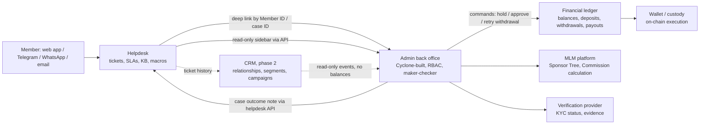

# 05 — CRM and customer operations

- **Project:** Helm (client: AlphaWave)
- **Author:** Cyclone research
- **Research date:** 2026-10-06 (all prices below were seen on this date unless stated)
- **Scope:** Brief section 5 (CRM and customer operations), with cost inputs for section 7 and evidence rules from section 9.
- **Currency:** USD list prices. Prices are per agent (or user or seat) per month unless stated. "Annual" means billed annually; "monthly" means billed month to month.

**Evidence labels used in this note**

- **Verified**: confirmed on the vendor's own pricing page, documentation or trust page on the research date.
- **Vendor claim**: the vendor says so (marketing page, help article or blog), but we have not tested it or seen audit evidence.
- **Not verified**: the evidence is third-party, contradictory or missing. Confirm before relying on it.
- **Estimate**: Cyclone consultant estimate. It is not a vendor figure.

We have spoken with Salesforce and Odoo before. Neither is implemented, and both are assessed here on the same terms as the other vendors.

---

## 1. Summary and recommendation

**What we recommend**

1. **For the first 30 days, use a dedicated SaaS helpdesk, not a CRM suite.**
   - Customer operations at this stage are ticket handling: questions about Deposits and withdrawals, KYC verification problems, Commission disputes and access issues. The helpdesk is the inbox. The Cyclone-built admin back office is where agents look things up and where operational actions happen.
   - Connect the two with deep links and a sidebar app keyed on the Member ID.
   - A helpdesk can be configured in about 2–3 weeks elapsed. A Salesforce or Odoo CRM build is likely to take longer than the 30-day window (Estimate).
2. **Shortlist Zendesk Suite Professional and Freshdesk Omni (Pro or Enterprise) for a scripted trial. Keep Intercom as the option if chat and Telegram will be the main channels.**
   - **Zendesk Suite Professional:**
     - $115/agent annual ([Verified](https://www.zendesk.com/pricing/)).
     - Includes SLAs, ticket approvals, up to 30 custom objects and a free data-location add-on (US, EEA, UK, JP, AU).
     - **Gap:** the account audit log ([Verified](https://support.zendesk.com/hc/en-us/articles/4408828001434-Viewing-the-audit-log-for-changes-to-your-account)) and custom agent roles ([Verified, pricing grid](https://www.zendesk.com/pricing/)) need Suite Enterprise, which is priced by quote.
   - **Freshdesk Omni Enterprise:**
     - $119/agent annual ([Verified](https://www.freshworks.com/freshdesk/omni/pricing/)).
     - Includes audit logs, custom objects and a sandbox at a published price.
     - Telegram is connected through a Freshchat marketplace app.
   - **Intercom:**
     - Telegram is a native channel ([Vendor claim](https://www.intercom.com/help/en/collections/19678202-telegram)).
     - 15 custom objects are included on all plans ([Vendor claim](https://www.intercom.com/help/en/articles/6298293-data-connectors-and-custom-objects-faqs)).
     - SSO and SLAs need the Expert plan, $132/seat annual ([Verified](https://www.intercom.com/pricing)).
     - The AI agent is charged per outcome on top of seats.
3. **Treat Salesforce and Odoo as candidates for the CRM expansion phase, not as the 30-day helpdesk.**
   - **Salesforce:**
     - Strongest case management, entitlements, audit options and data residency.
     - Highest licence cost: Service Cloud Core is $195/user/month annual ([Verified](https://www.salesforce.com/service/pricing/)).
     - Highest implementation and admin effort.
     - Telegram needs a custom "Bring Your Own Channel" integration.
   - **Odoo:**
     - Lowest licence cost.
     - Helpdesk, Knowledge, Approvals and Studio are Enterprise-only ([Verified](https://www.odoo.com/page/editions)).
     - The external API requires the Custom plan ([Verified](https://www.odoo.com/pricing)).
     - Telegram is available only through third-party modules. These cannot be installed on Odoo Online, so Telegram would mean Odoo.sh or self-hosting (Vendor claim, forum; see section 3.1).
4. **No CRM or helpdesk holds authoritative financial data.**
   - Balances, Deposits, withdrawals and Commission payouts are recorded in the financial ledger.
   - Sponsor Tree and Commission calculations live in the MLM platform.
   - KYC status lives in the verification provider and the platform identity service.
   - Withdrawal approval, holds and adjustments are back-office actions with maker-checker controls. They are never helpdesk or CRM actions (see section 5).

**Indicative monthly licence cost for the helpdesk (Estimate built from Verified list prices, annual billing)**

| Case | Basis | 5 agents | 15 agents |
|---|---|---|---|
| Low | Freshdesk Omni Growth at $29, or Zendesk Suite Team at $55 | $145–$275 | $435–$825 |
| Base | Zendesk Suite Professional at $115, or Freshdesk Omni Enterprise at $119 | $575–$595 | $1,725–$1,785 |
| High | Zendesk Suite Enterprise (quote), or Salesforce Service Cloud Core at $195 + Enhanced Messaging at $75 | ≈$1,350+ | ≈$4,050+ |

Add usage-based AI and messaging fees (section 6.2).

**Implementation effort for the 30-day helpdesk (Estimate):** about 1.5 person-months (range 0.75–2.5) across helpdesk configuration, back-office integration and knowledge-base set-up. Engineering effort is not the same as elapsed time: procurement, WhatsApp Business verification and security review (PRD gate RG-007) run in parallel and cannot be shortened by adding staff.

---

## 2. Requirements we evaluated against

These come from the research brief (section 5) and the client PRD. The PRD is a reference, not a binding specification.

- **Support is ticketed, role-scoped and auditable.** Agents see only the minimum Member data a case needs. Agents cannot request private keys, change the Sponsor Tree, approve payouts outside controls, or give financial recommendations. ([`references/alphawave-prd.md`](../../references/alphawave-prd.md), GFR-008 and the "Support agent" role.)
- **AI support, if used, is limited to approved knowledge and must escalate.** (PRD GFR-008, P2-003.)
- **Support channels are controlled, and private-key sharing is forbidden.** (PRD P0-009.)
- **Third-party support tools need security review before adoption.** The review covers data access, wallet safety, screen visibility, retention and role scope. (PRD P1-008, RG-007.)
- **The PRD rules out an "Admin CRM as a user-facing product".** Any CRM is therefore internal tooling.
- **Case types needed in the first 30 days:**
  - Deposit not credited.
  - Withdrawal pending, failed or wrong address.
  - KYC or verification rejected or stuck (if KYC applies; the "no KYC for crypto Deposits" assumption is unverified, see brief section 2).
  - Commission dispute or missing Commission.
  - Sponsor Tree or referral attribution query.
  - Account access, MFA or lockout.
  - Suspected fraud or phishing (for example, someone impersonating support on Telegram).
- **Channels:**
  - Email and in-app or web chat are the baseline.
  - Telegram and WhatsApp matter for MLM communities. They also raise the impersonation and phishing risk, so a verified official account and a "we never ask for keys or seed phrases" message are part of the set-up.

---

## 3. Vendor assessments

### 3.1 Odoo (Community vs Enterprise; Helpdesk, CRM, Knowledge)

**Editions and apps**

- Community does **not** include Helpdesk, Knowledge, Approvals, Studio, Sign or WhatsApp. CRM and Live Chat are in both editions. ([Verified, editions table](https://www.odoo.com/page/editions))
- A Community-only helpdesk would therefore depend on third-party or OCA modules. That is not a credible 30-day path.

**Plans and pricing** ([Verified, pricing page](https://www.odoo.com/pricing))

- *One App Free:* one app, unlimited users, Odoo Online only.
- *Standard:* all apps, Odoo Online only. No Studio, no external API, no multi-company, no Odoo.sh.
- *Custom:* all apps plus Studio, multi-company, external API and AI. Can be hosted on Odoo Online, Odoo.sh (hosting billed separately) or on-premise.
- Licences are per internal user. Light users cost $2.90.
- **The USD price shown depends on the visitor's country.** On the research date the page showed us:
  - Standard: $7.25 annual / $9.10 monthly. These are first-year discounted prices; the regular prices are $8.95 / $11.20.
  - Custom: $13.40 annual / $16.40 monthly; regular $16.40 / $20.40.
  - The discount applies for 12 months to the users in the first order.
- A third-party source reports **US** list prices of $31.10 Standard and $61.00 Custom (annual), discounted to $24.90 and $49.00 in year one ([Not verified, erpresearch.com](https://www.erpresearch.com/pricing/odoo)).
- **AlphaWave's billing country will decide the real price. Get a quote.**

**Hosting**

- **Odoo Online (SaaS):** cannot install custom or third-party modules ([Vendor claim, Odoo forum answers](https://www.odoo.com/forum/help-1/installation-of-third-party-apps-230075)).
- **Odoo.sh (PaaS):**
  - Billed per worker, storage and staging environment. The calculator does not show rates as static text ([odoo.sh/pricing](https://www.odoo.sh/pricing)).
  - Third parties cite roughly $57.60–$72 per worker per month ([Not verified](https://oec.sh/odoo-pricing/odoo-sh)).
- **Self-hosted:** Cyclone or AlphaWave would carry operations, patching and backups.

**Capability by requirement**

| Requirement | Assessment | Evidence |
|---|---|---|
| Customer profile | Contact record (`res.partner`). Studio (Custom plan) adds fields: Member ID, KYC status snapshot, back-office URL. Custom models are possible with Studio or code. | [Verified, editions](https://www.odoo.com/page/editions) |
| Ticketing | SLA policies by customer, priority, team or ticket type. Custom stages and automations. Ratings. | [Vendor claim](https://www.odoo.com/app/helpdesk-features) |
| Knowledge base | Knowledge app; articles can be published publicly. | [Vendor claim](https://www.odoo.com/app/helpdesk-features) |
| Channels: email, live chat, WhatsApp | Native. WhatsApp is Enterprise-only and needs a Meta WhatsApp Business account. | [Vendor claim](https://www.odoo.com/app/helpdesk) |
| Channels: Telegram | Not native. Only third-party modules (for example `acelero_telegram`, about $57), which need Odoo.sh or on-premise hosting. | [Vendor claim, apps store](https://apps.odoo.com/apps/modules/18.0/acelero_telegram) |
| Approvals | Approvals app (Enterprise). | [Verified](https://www.odoo.com/page/editions) |
| Audit | Record-level "chatter" change tracking. We found no SIEM-grade audit log. | Not verified |
| API and webhooks | JSON-2 API, external API on the Custom plan only. Automation rules can send and receive webhooks. | [Verified, API docs](https://www.odoo.com/documentation/19.0/developer/reference/external_api.html); [Verified, webhooks docs](https://www.odoo.com/documentation/19.0/applications/studio/automated_actions/webhooks.html) |
| SSO | OAuth and LDAP built in ([docs](https://www.odoo.com/documentation/18.0/applications/general/users/ldap.html)). SAML only through third-party modules. | Partly verified |
| Data residency | Hosting regions: USA, Canada, Europe (FR, BE), Singapore, Taiwan, India, Saudi Arabia, Australia. Databases go to the nearest region; customers can ask for a change. Backup locations cannot be chosen. | [Verified, privacy policy](https://www.odoo.com/privacy) |
| Security certifications | Security page cites CSA STAR Level 1, AES-256 at rest and backups replicated across 3 data centres. | [Verified](https://www.odoo.com/security) |
| ISO 27001 and SOC reports | Odoo blog and forum reportedly claim ISO 27001:2022 and SOC 1/SOC 2 reports. The pages returned HTTP 403 to us. | [Not verified](https://www.odoo.com/blog/odoo-news-5/your-data-secured-odoo-is-iso-27001-certified-2196) |

**Effort (Estimate)**

- 30-day helpdesk MVP on Odoo Online with the Custom plan: 2–3 person-months.
- Add 1–2 person-months for Odoo.sh plus Telegram modules and custom back-office widgets.
- Ongoing admin: about 0.25–0.5 FTE of an Odoo functional admin. Odoo also has a yearly version-upgrade cadence.

**Fit**

- Best value if AlphaWave later wants one ERP-style suite (CRM, helpdesk, accounting for the operating company, marketing).
- Weaker as a pure support tool: Telegram, SAML and enterprise-grade audit all need extra work.
- Cyclone does not recommend Odoo accounting as the customer-funds ledger. The ledger is a separate workstream.

### 3.2 Salesforce (Service Cloud / Agentforce Service; Sales Cloud; Financial Services Cloud)

**Pricing** ([Verified, Service pricing](https://www.salesforce.com/service/pricing/))

| Edition | Price per user per month | Billing |
|---|---|---|
| Starter Suite | $25 | Monthly or annual |
| Pro Suite | $100 | Annual, contract required |
| Core | $195 | Annual |
| Advanced | $395 | Annual. Adds a full sandbox, Premier Success, Backup & Recover, Data Detect |
| Max | $550 | Annual. Adds the full Agentforce suite and Flex Credits |

- The comparison grid shows "Web Services API: Additional $25 USD/user/month" for a lower edition, and "Enhanced Messaging: Additional $75 USD/user/month" for some editions. We could not confirm which edition each add-on applies to from the static page. **Confirm in a quote.**
- Sales Cloud uses the same price ladder ($0 Free / $25 / $100 / $195 / $395 / $550) ([Verified](https://www.salesforce.com/sales/pricing/)).
- Financial Services Cloud Service editions: Core $325, Advanced $500, Max $700 per user per month, annual ([Verified](https://www.salesforce.com/financial-services/pricing/)).
  - Financial Services Cloud is built for banks, wealth managers and insurers: households, financial accounts and advisor workflows.
  - Its financial-account objects could tempt teams to mirror balances into the CRM. That would break the "CRM is not the source of truth" rule.
  - **It is not justified for Helm's first phases.**

**Capability by requirement**

| Requirement | Assessment | Evidence |
|---|---|---|
| Customer profile and custom objects | Industry-leading. Custom objects such as `Member__c`, `Wallet_Reference__c` and `KYC_Status__c`, record types, and roles and permissions. | [Verified, grid](https://www.salesforce.com/service/pricing/) |
| Case management | Case console, auto-assignment, escalation rules and queues, Omni-Channel routing, Knowledge, milestones, and entitlements (SLA). Listed for the Core edition and above. | [Verified, grid](https://www.salesforce.com/service/pricing/) |
| Approvals and automation | Workflow and Approval. Flow Builder (5 flows per org on Starter, unlimited above). | [Verified, grid](https://www.salesforce.com/service/pricing/) |
| Audit | Setup Audit Trail and Field History Tracking (20 fields per object, 18–24 months retention). Field Audit Trail (200 fields, indefinite retention) needs Shield or a Field Audit Trail licence. | [Verified, help](https://help.salesforce.com/s/articleView?language=en_US&id=xcloud.field_audit_trail.htm&type=5) |
| Channels: email, web | Native. | [Verified, grid](https://www.salesforce.com/service/pricing/) |
| Channels: WhatsApp | Through Messaging (Enhanced Messaging). Needs a Meta Business account, a WhatsApp Business account and Omni-Channel. | [Vendor claim](https://help.salesforce.com/s/articleView?id=sf.messaging_whatsapp_considerations.htm&language=en_US&type=5) |
| Channels: Telegram | Not native. "Bring Your Own Channel" needs the Digital Engagement add-on plus an AppExchange package or a custom build. | [Vendor claim](https://help.salesforce.com/s/articleView?id=sf.partner_messaging_install.htm&language=en_US&type=5) |
| API and SSO | REST, Bulk and Platform Events. Salesforce Identity is listed in the grid. | [Verified, grid](https://www.salesforce.com/service/pricing/) |
| Data residency | Hyperforce runs Sales and Service in 18 countries, including US, UK, DE, FR, SG, JP, AU, IN, CA, AE, CH, SE, IL, ZA. | [Vendor claim](https://help.salesforce.com/s/articleView?id=release-notes.rn_hyperforce_access_salesforce_in_more_regions_with_hyperforce.htm&language=en_US&type=5) |
| Security certifications | ISO 27001/27017/27018 and a SOC 2 report for Salesforce Services, consolidated from June 2026. Reports are available on the compliance portal. | [Vendor claim, compliance portal](https://compliance.salesforce.com/en/categories/soc-2) |

**Effort (Estimate)**

- Service Cloud MVP (case model, queues, entitlements, Knowledge, email and web, a back-office link, SSO): 3–5 person-months, 6–10 weeks elapsed.
- WhatsApp: add about 0.5 person-months.
- Telegram through Bring Your Own Channel: add 1–2 person-months.
- Ongoing: 0.5–1 FTE of a certified admin or developer, plus release management (three releases a year).

**Fit**

- The right platform if AlphaWave grows into a large multi-team operation: sales to leaders, partner portals, complex entitlements, Shield-grade audit.
- Too heavy and costly for 3–10 agents in the first 30 days.

### 3.3 Zendesk

**Pricing** ([Verified](https://www.zendesk.com/pricing/))

| Plan | Annual | Monthly |
|---|---|---|
| Support Team | $19 | $25 |
| Suite Team | $55 | $69 |
| Suite Professional | $115 | $149 |
| Suite Enterprise | Quote | Quote |

- AI agent automated resolutions are charged beyond the included allowance: $1.50 committed or $2.00 pay-as-you-go.
- Copilot add-on: $50/agent annual.

**Capability by requirement**

| Requirement | Assessment | Evidence |
|---|---|---|
| Customer profile and custom objects | Suite Team: up to 3 custom objects. Suite Professional: up to 30. Lookup fields link them to users and tickets. | [Verified](https://www.zendesk.com/pricing/) |
| SLAs | Suite Professional and above. | [Verified](https://www.zendesk.com/pricing/) |
| Approvals | Ticket approval requests on Customer Service Suite Professional and above. | [Verified, help](https://support.zendesk.com/hc/en-us/articles/8481179038490-Understanding-approvals-and-how-they-work) |
| Audit log | Enterprise only. Records agent and admin changes, including custom objects. | [Verified, help](https://support.zendesk.com/hc/en-us/articles/4408828001434-Viewing-the-audit-log-for-changes-to-your-account) |
| Custom agent roles | Enterprise only. This matters for "minimum data per case". | [Verified, grid](https://www.zendesk.com/pricing/) |
| Sandbox | Add-on on Suite Professional; included on Enterprise. | [Verified](https://www.zendesk.com/pricing/) |
| Channels: email, messaging, WhatsApp | Native on Suite plans. | [Vendor claim](https://www.zendesk.com/pricing/) |
| Channels: Telegram | Through Sunshine Conversations channels in Agent Workspace, or marketplace apps. | [Vendor claim](https://support.zendesk.com/hc/en-us/articles/4408836484378-Adding-Sunshine-Conversations-channels-to-the-Zendesk-Agent-Workspace) |
| SSO | JWT and SAML on all plans. | [Verified](https://www.zendesk.com/pricing/) |
| API and webhooks | Mature REST API, webhooks, sidebar app framework (ZAF). | [Vendor claim](https://developer.zendesk.com/api-reference/) |
| Data residency | Free Data Center Location add-on on Suite Professional and above: US, EEA, UK, Japan, Australia. | [Verified, help](https://support.zendesk.com/hc/en-us/articles/4408838409754-About-the-Data-Center-Location-add-on) |
| Security certifications | SOC 2 Type II (on request, under NDA). ISO 27001:2022, 27017, 27018, 27701, 42001. | [Vendor claim, trust center](https://www.zendesk.com/trust-center/) |

**Effort (Estimate)**

- 1–2 person-months for the MVP.
- Admin: about 0.2–0.4 FTE.

**Fit**

- Strongest general helpdesk with the widest channel coverage and ecosystem.
- Main cost risk: audit log and custom roles need a quoted Enterprise tier.

### 3.4 Freshdesk / Freshdesk Omni (Freshworks)

**Pricing** (annual billing, per agent per month)

| Product | Growth | Pro | Enterprise | Evidence |
|---|---|---|---|---|
| Freshdesk (ticketing) | $19 | $55 | $89 | [Verified](https://www.freshworks.com/freshdesk/pricing/) |
| Freshdesk Omni (adds chat and messaging) | $29 | $79 | $119 | [Verified](https://www.freshworks.com/freshdesk/omni/pricing/) |

- The pages advertise "save 20% annually". Monthly plan rates are not in the static page, so they are not captured here.
- Freddy AI Copilot: $29 annual / $35 monthly per agent.
- AI agent: 500 sessions included, then $49 per 100 sessions.

**Capability by requirement**

| Requirement | Assessment | Evidence |
|---|---|---|
| Custom objects | **Sources conflict.** The help article lists Pro and Enterprise (up to 5 lookups and 100 fields per object, API access) ([help](https://support.freshdesk.com/support/solutions/articles/50000004224-overview-of-custom-objects-in-freshdesk)). The Omni pricing page shows Enterprise only ([pricing](https://www.freshworks.com/freshdesk/omni/pricing/)). | Not verified for Pro |
| SLAs | Multiple SLA policies from Pro. | [Verified](https://www.freshworks.com/freshdesk/pricing/) |
| Approvals | Approval workflow listed on Omni plans. | [Vendor claim](https://www.freshworks.com/freshdesk/omni/pricing/) |
| Audit logs | Enterprise. | [Verified](https://www.freshworks.com/freshdesk/pricing/) |
| Sandbox and IP allow-listing | Enterprise. | [Verified](https://www.freshworks.com/freshdesk/pricing/) |
| Roles and permissions | From Growth. | [Verified](https://www.freshworks.com/freshdesk/pricing/) |
| Channels: WhatsApp | Omni plans. | [Vendor claim](https://www.freshworks.com/freshdesk/omni/pricing/) |
| Channels: Telegram | Freshchat marketplace app. Supports text and images; needs a bot token. | [Vendor claim](https://crmsupport.freshworks.com/support/solutions/articles/50000006087-telegram-in-freshchat) |
| API and webhooks | REST API; webhook actions in automations. | [Vendor claim](https://developers.freshdesk.com/api/) |
| Data residency | US, EU, India, Australia, Middle East (AWS). | [Vendor claim](https://www.freshworks.com/security/trust/) |
| Security certifications | SOC 2 Type II and ISO 27001, audited at least yearly. | [Vendor claim](https://www.freshworks.com/security/trust/) |

**Effort (Estimate)**

- 1–2 person-months.
- Admin: about 0.2–0.4 FTE.

**Fit**

- The most complete set of controls at a published price (audit logs, custom objects, sandbox on Omni Enterprise at $119).
- Telegram depends on a marketplace app. Verify who publishes and supports it during the security review.

### 3.5 Intercom

**Pricing** ([Verified](https://www.intercom.com/pricing))

| Plan | Annual price per seat per month | Notes |
|---|---|---|
| Essential | $19 | |
| Advanced | $85 | 20 free Lite seats |
| Expert | $132 | 50 free Lite seats. Adds SSO and identity management, SLAs, HIPAA support |

- Monthly seat rates are not captured: the page loads them dynamically. The page also shows $29 for Essential on one view (Not verified as the monthly rate).
- Fin AI agent: $0.99 per outcome, with a minimum monthly commitment when used with another helpdesk.
- WhatsApp and SMS are charged per conversation or message.
- Copilot: $29 annual / $35 monthly per agent.

**Capability by requirement**

| Requirement | Assessment | Evidence |
|---|---|---|
| Custom objects | 15 custom objects and 100k records on all plans. Data connectors can pull live data from the back office into the inbox, so the back office stays the source of truth. | [Vendor claim](https://www.intercom.com/help/en/articles/6298293-data-connectors-and-custom-objects-faqs) |
| Channels: Telegram | Native. Bots, Business accounts and group chats. | [Vendor claim](https://www.intercom.com/help/en/collections/19678202-telegram) |
| Channels: WhatsApp | Native, usage-billed. | [Verified](https://www.intercom.com/pricing) |
| Ticketing and help center | Tickets and help center on all plans. Workflows from Advanced. | [Verified](https://www.intercom.com/pricing) |
| Admin audit log | Plan availability not verified. Data-connector execution logs are kept for 14 days. | Not verified |
| Data residency | US, EU or Australia hosting, for new workspaces on Advanced and Expert. | [Vendor claim](https://www.intercom.com/help/en/articles/6124430-regional-data-hosting) |
| Security certifications | SOC 2 Type II; ISO 27001, 27018, 27701, 42001. | [Vendor claim](https://www.intercom.com/security) |

**Effort (Estimate)**

- 1–1.5 person-months.
- Admin: about 0.2–0.3 FTE.

**Fit**

- Best for chat-led support, Telegram and AI deflection.
- Weaker as a formal case-management and audit tool unless on Expert.
- The PRD requires AI support to stay within approved knowledge and escalate. Fin can be restricted to approved content, but that is a configuration and governance task.

### 3.6 HubSpot Service Hub (considered, not shortlisted)

**Pricing**

- The pricing page is script-rendered. The fetched text reads:
  - Starter: "$7/mo/seat" (annual) and "$20/mo/seat" (monthly).
  - Professional: "$90/mo/seat" (annual) and "$100/mo/seat" (monthly), plus a $1,500 onboarding fee.
  - Enterprise: from $150/seat, plus a $3,500 onboarding fee.
- This is labelled **Not verified**: the Starter figure needs re-checking ([pricing](https://www.hubspot.com/pricing/service)).

**Why it is not shortlisted**

- Custom objects, the audit log and SSO are Enterprise-only ([Vendor claim, KB](https://knowledge.hubspot.com/account-security/limit-access-to-your-hubspot-assets); [catalog](https://legal.hubspot.com/hubspot-product-and-services-catalog)).
- Telegram is not native.
- The strength is marketing and sales CRM, which this phase does not need.
- It can be reconsidered for the CRM expansion if AlphaWave runs marketing campaigns to Members.

---

## 4. Comparison table

Legend:

- ● = native on the noted plan.
- ◐ = add-on, quote or third-party.
- ○ = not available or not verified.

Plan names in brackets are the lowest plan with the capability.

| Capability | Odoo Enterprise (Custom) | Salesforce Service Cloud | Zendesk Suite | Freshdesk Omni | Intercom |
|---|---|---|---|---|---|
| Member ID, KYC status and wallet reference on the profile | ● Studio fields and models | ● Custom objects | ● (Professional: 30 objects) | ◐ (Pro or Enterprise, sources conflict) | ● 15 objects, data connectors |
| Ticketing | ● | ● | ● | ● | ● |
| SLA | ● | ● Entitlements | ● (Professional) | ● (Pro) | ● (Expert) |
| Knowledge base | ● | ● | ● | ● | ● |
| Email and web chat | ● | ● | ● | ● | ● |
| WhatsApp | ● (Enterprise) | ◐ Messaging add-on | ● | ● | ● (usage-billed) |
| Telegram | ◐ third-party, Odoo.sh or on-prem only | ◐ Bring Your Own Channel build | ◐ Sunshine Conversations or apps | ◐ Freshchat app | ● native |
| Approvals | ● Approvals app | ● | ● (Professional) | ● | ○ not verified |
| Admin audit log | ◐ chatter tracking only | ● Setup Audit Trail; ◐ Shield | ◐ (Enterprise, quote) | ● (Enterprise) | ○ not verified |
| Custom roles | ● | ● | ◐ (Enterprise) | ● | ● |
| API and webhooks | ● (Custom plan) | ● (API add-on on lower editions) | ● | ● | ● |
| SSO (SAML) | ◐ third-party | ● | ● all plans | ● | ● (Expert) |
| Data residency choice | ● 8 regions (request) | ● Hyperforce, 18 countries | ● (Professional: US, EEA, UK, JP, AU) | ● US, EU, IN, AU, ME | ● (Advanced: US, EU, AU) |
| SOC 2 / ISO 27001 | ○ not verified (CSA STAR L1 verified) | ● vendor claim | ● vendor claim | ● vendor claim | ● vendor claim |
| 30-day MVP feasibility (Estimate) | Medium | Low–Medium | High | High | High |
| MVP effort in person-months (Estimate) | 2–3 | 3–5 | 1–2 | 1–2 | 1–1.5 |
| Ongoing admin in FTE (Estimate) | 0.25–0.5 | 0.5–1 | 0.2–0.4 | 0.2–0.4 | 0.2–0.3 |

**Eligibility before scoring (brief section 9)**

A tool is eligible for the 30-day helpdesk only if it meets all of these:

- Hosted SaaS, or a credible managed option.
- Role-based permissions.
- An API to link to the back office.
- SSO, or SSO available on the chosen plan.
- An audit capability that is native or on a path at a published or quoted price.
- No requirement to store balances.

All five meet these on some plan.

- **Odoo Community** fails: it has no Helpdesk or Knowledge.
- **HubSpot below Enterprise** fails on audit log and SSO.

---

## 5. System boundaries: CRM vs helpdesk vs admin back office vs ledger

| System | Owns (source of truth) | Must not own or do | Agent access |
|---|---|---|---|
| **Financial ledger** | Balances, Deposits, withdrawals, Commission payouts, reconciliation state | Customer conversations; ad-hoc edits | None directly. Only through back-office commands. |
| **MLM platform** | Sponsor Tree, compensation-plan versions, Commission calculations and explanations | Payout execution (handled by the ledger and custody); ticket handling | Read-only views through the back office |
| **Verification provider and identity service** | KYC/KYB status, verification evidence, sanctions results | Being copied wholesale into the helpdesk | Status only. Evidence goes to the compliance role only. |
| **Admin back office (Cyclone-built)** | Operational actions: withdrawal hold, approve or retry, account freeze, address-change review, Commission adjustment requests with maker-checker. Also the admin action audit log and role-based field masking. | Customer messaging; SLA tracking; long-term relationship data | Role-scoped. Financial actions need a second approver. |
| **Helpdesk** | Conversations, tickets, case type and status, SLA timers, knowledge base, macros, CSAT, the support-agent action log | Balances, wallet secrets, KYC documents, approval of funds movements, Sponsor Tree changes | All agents. Each case stores only reference IDs: Member ID, back-office case or transaction ID, transaction hash. |
| **CRM (expansion)** | Relationship context: leader accounts, onboarding pipeline, segments, campaign engagement, account-manager notes | Balances or Commission amounts treated as authoritative. Any number shown is a labelled, time-stamped snapshot, or better a live lookup. | Sales or Member-success staff |

**Design rules**

1. The helpdesk stores **references, not values**. A sidebar app or data connector fetches Member status live from the back office, so data is not duplicated and PII exposure is minimised (PRD P3, P4).
2. **Ticket approvals in the helpdesk are only for non-financial decisions**, for example escalation sign-off or a goodwill response. Any funds movement is approved in the back office with maker-checker and logged there.
3. Agents never ask for private keys or seed phrases. Macros and the KB say so. Inbound messages are screened for seed-phrase patterns (PRD P0-009).
4. Automated case creation runs **from the back office into the helpdesk**. Examples: a withdrawal failing or stuck longer than X, a KYC rejection, a Commission dispute filed in-app. These go through the helpdesk API or webhooks with a back-office reference ID.
5. Wallet addresses are pseudonymous personal data. Show them on demand in the sidebar instead of syncing them into helpdesk fields where possible.

---

## 6. Minimum viable customer-ops setup (first 30 days) and expansion path

### 6.1 30-day MVP

**Tool**

- One SaaS helpdesk chosen from the shortlist after a one-week scripted trial.
- Base case: Zendesk Suite Professional or Freshdesk Omni Enterprise.
- Intercom Advanced or Expert if Telegram and chat dominate.

**People**

- 3–5 agents for a controlled pilot. Scale to 10 if Member volume requires it.
- 1 support lead.
- 0.25 FTE helpdesk admin.
- Escalation approvers in finance or operations and in compliance work in the back office. Where needed they use helpdesk light or Lite seats, which the vendors offer at low or no cost.

**Configuration**

- **Channels:**
  - Email and in-app or web widget are mandatory.
  - Telegram (verified official bot) and WhatsApp only if the Meta Business verification and channel security review are complete. Otherwise defer to the expansion phase.
- **Ticket forms and fields:**
  - Case type, chosen from: Deposit, withdrawal, KYC/verification, Commission dispute, Sponsor Tree/referral, account access, security/phishing, other.
  - Member ID.
  - Back-office reference.
  - Transaction hash (text).
  - Network or asset.
  - Severity.
- **Routing and SLAs:**
  - Security/phishing and withdrawal cases at P1.
  - Separate queues for funds, verification and Commission.
- **Escalation:** tier 1 support → tier 2 operations (back office) → compliance or finance approver. Escalation reasons are recorded.
- **Knowledge base:** 20–40 articles covering:
  - How Deposits and withdrawals work.
  - Network fees.
  - Wrong-network Deposits.
  - Verification steps.
  - How Commissions are calculated and when they are paid.
  - Security warnings.
  - Content needs compliance review; it must not be financial advice (PRD GFR-008).
- **Integration:**
  - Back-office deep link from each ticket.
  - A read-only sidebar showing Member status, KYC status and recent transactions by reference.
  - Back-office webhooks that create tickets.
  - SSO for agents.
- **AI agent:** off, or limited to answering from the approved KB, with forced escalation for any funds or verification topic.

**Effort (Estimate)**

| Workstream | Person-months (low / base / high) |
|---|---|
| Helpdesk configuration and admin | 0.3 / 0.5 / 0.8 |
| Back-office integration (sidebar, deep links, webhooks, SSO) | 0.3 / 0.6 / 1.0 |
| KB and macros (Cyclone-authored, client and compliance reviewed) | 0.15 / 0.3 / 0.5 |
| Training and runbooks | 0.05 / 0.1 / 0.2 |
| **Total** | **0.75 / 1.5 / 2.5** |

- Elapsed time: about 2–3 weeks, provided procurement is done.
- The back-office features themselves (withdrawal operations, Member view) are counted in the admin and back-office workstream, not here.

### 6.2 Licence cost table

All prices seen 2026-10-06, annual billing unless stated. Totals are list price × seats.

| Option | List price per agent per month | Status | 5 agents | 15 agents | Usage-based extras (not in totals) |
|---|---|---|---|---|---|
| Freshdesk Growth | $19 | Verified | $95 | $285 | AI sessions $49 per 100 after 500 |
| Freshdesk Pro | $55 | Verified | $275 | $825 | Same |
| Freshdesk Enterprise | $89 | Verified | $445 | $1,335 | Same |
| Freshdesk Omni Growth | $29 | Verified | $145 | $435 | WhatsApp messaging fees (Meta) |
| Freshdesk Omni Pro | $79 | Verified | $395 | $1,185 | Same |
| Freshdesk Omni Enterprise | $119 | Verified | $595 | $1,785 | Same |
| Zendesk Suite Team | $55 ($69 monthly) | Verified | $275 | $825 | AI resolutions $1.50–$2.00 beyond allowance |
| Zendesk Suite Professional | $115 ($149 monthly) | Verified | $575 | $1,725 | Same; Sunshine Conversations MAU packs |
| Zendesk Suite Enterprise | Quote | Quote required | — | — | — |
| Intercom Essential | $19 | Verified | $95 | $285 | Fin $0.99 per outcome; WhatsApp per conversation |
| Intercom Advanced | $85 | Verified | $425 | $1,275 | Same |
| Intercom Expert | $132 | Verified | $660 | $1,980 | Same |
| Odoo Custom (price shown to us, regional) | $13.40 yr-1 / $16.40 regular | Verified (region-specific) | $67–$82 | $201–$246 | Odoo.sh hosting if used |
| Odoo Custom (US, third-party) | $49 yr-1 / $61 regular | Not verified | $245–$305 | $735–$915 | Odoo.sh roughly $58–$72 per worker (Not verified) |
| Salesforce Pro Suite | $100 (+$25 API add-on, edition not confirmed) | Verified / quote | $500–$625 | $1,500–$1,875 | Messaging add-on |
| Salesforce Service Core | $195 | Verified | $975 | $2,925 | Enhanced Messaging +$75/user (quote) |
| Salesforce Service Advanced | $395 | Verified | $1,975 | $5,925 | Same |
| Salesforce FSC Service Core | $325 | Verified | $1,625 | $4,875 | Not recommended for this phase |
| HubSpot Service Professional | $90 | Not verified (rendered page) | $450 | $1,350 | +$1,500 one-time onboarding |

**Notes on the table**

- Odoo licenses every internal user, including back-office staff who log in. The SaaS helpdesks license agents only; light or Lite seats are cheap or free.
- Prices exclude tax.
- Salesforce and Zendesk Enterprise discounts are negotiated and not public.

### 6.3 Expansion path

**Phase 2 (about months 2–4): harden the helpdesk**

- Add Telegram and WhatsApp channels once verified accounts and security review are in place.
- Upgrade to the tier that unlocks audit log and custom roles if not bought on day one (Zendesk Enterprise or Freshdesk Omni Enterprise).
- Add a sandbox, QA scoring and CSAT.
- Turn on the AI agent restricted to the approved KB, measured on deflection without misinformation.
- Add multilingual KB content.

**Phase 3 (about months 4–9): add a CRM layer if the business case exists**

- Use cases:
  - Leader and top-of-Sponsor-Tree relationship management.
  - Onboarding pipelines for new markets.
  - Campaign segmentation.
  - Member-success outreach.
- Options:
  - The helpdesk vendor's own CRM (Freshworks Freshsales, Zendesk Sell, HubSpot). Simplest data model.
  - **Odoo Custom** if AlphaWave also wants ERP functions for the operating company. Lowest licence cost; implementation estimated at 3–6 person-months.
  - **Salesforce** if scale, partner portals or Shield-grade audit are needed. Implementation estimated at 4–8 person-months plus 0.5–1 FTE admin.
- In every option the CRM receives read-only events from the back office and never holds authoritative balances or Commission figures.

**Phase 4 (later): consolidation**

- If Salesforce or Odoo becomes the CRM, decide whether to keep the helpdesk separate or migrate support into Service Cloud or Odoo Helpdesk.
- Moving support is a large change. Budget 2–4 person-months for migrating tickets, the KB and integrations (Estimate).

---

## 7. Open questions

**For the client**

1. Which countries are Members and the operating entity in? This drives data residency (Zendesk, Intercom and Freshworks offer a choice), Odoo country pricing, and whether WhatsApp and Telegram are acceptable channels.
2. How many Members in the pilot, how many tickets per month, and which support languages? This sets the agent count (5 vs 15) and the multilingual KB scope.
3. Are Telegram groups and channels already the main way the MLM network communicates? Is there an official AlphaWave Telegram presence to verify and protect against impersonation?
4. Will KYC apply at launch? (This is a legal question; see brief section 2.) It decides whether verification cases are in the 30-day scope.
5. Can operations staff who approve withdrawals use only the back office, or do they also need helpdesk seats?
6. Is there a preference for one vendor ecosystem (Microsoft or Google SSO, an existing Salesforce or Odoo relationship) that should outweigh tool-level fit?

**To confirm with vendors (in demos or quotes, without sharing client data before an NDA)**

7. **Zendesk:**
   - Suite Enterprise quoted price.
   - Whether Sunshine Conversations Telegram is included in Suite Professional or needs MAU packs.
   - Audit-log retention and export.
8. **Freshworks:**
   - Is the Omni Pro plan enough for custom objects? The help article and pricing page conflict.
   - Who publishes and supports the Telegram for Freshchat app?
   - Monthly-billing rates.
9. **Intercom:**
   - Which plan includes an admin audit log and custom roles.
   - Monthly seat rates.
   - Fin minimum commitments.
   - Whether regional hosting is available at Advanced for the target region.
10. **Salesforce:**
    - Which edition the API add-on ($25) and the Enhanced Messaging add-on ($75) apply to.
    - Digital Engagement licensing for Bring Your Own Channel (Telegram).
    - Hyperforce region for the target market.
11. **Odoo:**
    - AlphaWave's country-specific USD price.
    - Odoo.sh worker and storage rates.
    - Current ISO 27001 certificate and SOC report availability (the blog and forum were inaccessible to us).
    - Supported path for Telegram and SAML.

**Technical (Cyclone)**

12. The back-office API design for a read-only Member summary used by the helpdesk sidebar or data connector: fields, masking per role, rate limits.
13. Event catalogue for automatic ticket creation: withdrawal failed or stuck, Deposit unmatched, KYC rejected, Commission dispute filed.
14. Retention and deletion policy for support transcripts that may contain wallet addresses or identity data, aligned with PRD P4 and the legal advice.
